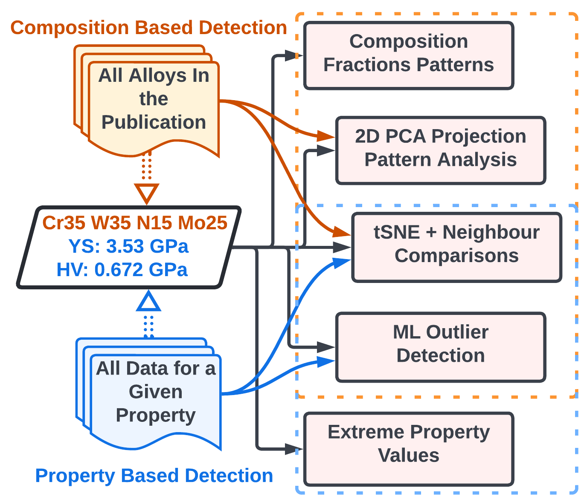

=========
PyQAlloy
=========

|GitHub top language| |PyPI - Python Version| |PyPI Version| |ULTERA statistics|

|Build Status|  |Commit Build Status| |Coverage Status| |GitHub license|

|GitHub last commit| |GitHub last release| |GitHub commits since tagged version| |GitHub issues|

.. |GitHub top language| image:: https://img.shields.io/github/languages/top/PhasesResearchLab/PyQAlloy
  :alt: GitHub top language
  :target: https://github.com/PhasesResearchLab/PyQAlloy

.. |PyPI - Python Version| image:: https://img.shields.io/pypi/pyversions/pyqalloy
  :alt: PyPI - Python Version
  :target: https://www.python.org/downloads/release/python-3100/

.. |PyPI Version| image:: https://img.shields.io/pypi/v/pyqalloy
  :alt: PyPI Version
  :target: https://pypi.org/project/pyqalloy/

.. |GitHub license| image:: https://img.shields.io/github/license/PhasesResearchLab/PyQAlloy
  :alt: GitHub license
  :target: https://github.com/PhasesResearchLab/PyQAlloy

.. |GitHub last commit| image:: https://img.shields.io/github/last-commit/PhasesResearchLab/PyQAlloy?label=Last%20Commit
  :alt: GitHub last commit
  :target: https://github.com/PhasesResearchLab/PyQAlloy/commits/main

.. |GitHub last release| image:: https://img.shields.io/github/release-date/PhasesResearchLab/PyQAlloy?label=Last%20Release
  :alt: GitHub Release Date - Published_At
  :target: https://github.com/PhasesResearchLab/PyQAlloy/releases

.. |ULTERA statistics| image:: https://img.shields.io/badge/ULTERA-statistics-red
  :alt: ULTERA statistics
  :target: https://ultera.org

.. |GitHub commits since tagged version| image:: https://img.shields.io/github/commits-since/PhasesResearchLab/PyQAlloy/v0.3.0?color=g
  :alt: GitHub commits since tagged version
  :target: https://github.com/PhasesResearchLab/PyQAlloy/releases

.. |GitHub issues| image:: https://img.shields.io/github/issues/PhasesResearchLab/PyQAlloy
  :alt: GitHub issues
  :target: https://github.com/PhasesResearchLab/PyQAlloy/issues

.. |Coverage Status| image:: https://codecov.io/gh/PhasesResearchLab/PyQAlloy/branch/main/graph/badge.svg?token=QZQZQZQZQZ
  :alt: Coverage Status
  :target: https://codecov.io/gh/PhasesResearchLab/PyQAlloy

.. |Build Status| image:: https://github.com/PhasesResearchLab/PyQAlloy/actions/workflows/test.yml/badge.svg
  :alt: Build Status
  :target: https://github.com/PhasesResearchLab/PyQAlloy

.. |Commit Build Status| image:: https://github.com/PhasesResearchLab/PyQAlloy/actions/workflows/lastCommit.yml/badge.svg
  :alt: Commit Build Status
  :target: https://github.com/PhasesResearchLab/PyQAlloy

PyQAlloy development is a part of `ULTERA
Project <https://ultera.org>`__ carried under the `DOE ARPA-E ULTIMATE
program <https://arpa-e.energy.gov/?q=arpa-e-programs/ultimate>`__ that
aims to develop a new generation of materials for turbine blades in gas
turbines and related applications. The `ULTERA
Project <https://ultera.org>`__, along is led by `Phases Research
Lab <https://phaseslab.com>`__ at Penn State. As a part of it, we
developed a new large-scale database of high entropy alloys (HEAs)
reported in the literature along with their experimental properties. As
of March 2023, the database contains around 6,000 property data points
of 2,500 HEAs coming from almost 500 publications. It is currently the
largest database of HEAs in the world, and while it is not publicly
available we welcome collaborators who would like to use it in their
research or contribute to it.

ULTERA Database is not simply a dataset but features a robust set of
data processing, curation, and aggregation tools we built for the last 3
years. These tools allowed us to remove around the 5-10% erroneous data
we identified in datasets available in the literature. Most of our tools
are not published yet, as the project is ongoing (they give us a
competitive advantage), and because most of the tools require an
elaborate computing infrastructure setup.

However, as some of them are less-infrastructure-demanding and are, at
the same time highly applicable outside HEAs, we decided to release them
as separate packages. This repository contains the first of such
packages, **PyQAlloy**, which is a Python package for detecting data
abnormalities in datasets of arbitrary alloys, ranging from complex,
concentrated solutions, i.e. High Entropy Alloys (HEAs) / Multi
Principle Element Alloys (MPEAs) / Concentrated Complex Alloys (CCAs) to
more traditional alloys such as steels, nickel-based superalloys, etc.

.. note::
   This project is under active development. We recommend using released (stable) versions.

Index
-----

.. toctree::
   install
   source/pyqalloy
   changelog
   examples/UserCuration
   examples/CustomDatasetFromBSON
   genindex
   :maxdepth: 2
   :caption: Contents